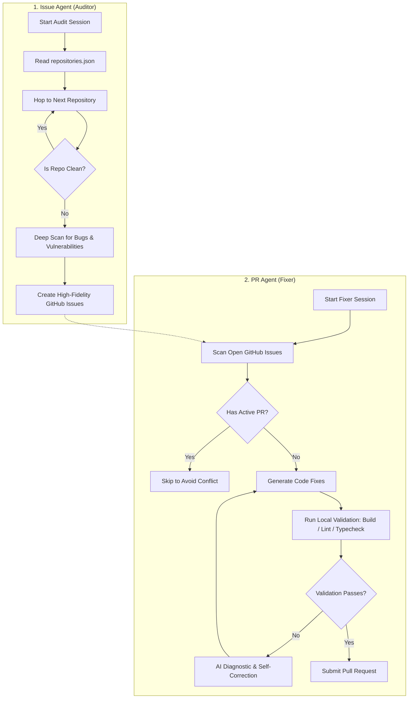

# 🤖 Bug-Bot: Autonomous Bug & Vulnerability Remediation Agent

An autonomous bug-hunting and PR-fixing bot designed to find, report, and remediate code vulnerabilities and issues across multiple repositories with surgical precision.

## 🏗️ Architecture: Dual-Agent Pipeline

The system is decoupled into two specialized modes of operation:




### 1. **The Issue Agent (Auditor)**
*   **Goal**: Performs deep, multi-repo audits to identify bugs, security vulnerabilities, and performance bottlenecks.
*   **Target**: Aims for **20–30 high-fidelity issues** per run.
*   **Strategy**: Uses a "Hop Strategy" to move between repositories if one is already clean.
*   **Run**: `npm run issue-agent`

### 2. **The PR Agent (Fixer)**
*   **Goal**: Autonomously resolves open issues by delivering surgical, validated code patches.
*   **Quality Gate**: Scans `package.json` and GitHub workflows to run project-specific validation (build, lint, typecheck) before submission.
*   **Capacity**: Processes your entire portfolio in a single session.
*   **Run**: `npm run pr-agent`

---

## 🚀 Industrial Resilience

The agent is built with multiple layers of "self-healing" logic:

| Error Type | Strategy |
| :--- | :--- |
| **429 (Rate Limit)** | Progressive backoff (1m, 4m, 5m delays). |
| **503 (Unavailable)** | 3 burst retries followed by two 1-minute wait cycles. |
| **Tool Failure** | Immediately returns the error to AI for diagnostic self-correction and next-step selection. |
| **Session Failure** | Global failover: Wait 5m and retry the entire session once. |
| **Timeout** | Mandatory 1-hour hard limit for all sessions to prevent resource leaks. |

---

## 📊 Grand Achievement Reporting

At the end of every session, the agent delivers a **Grand Report** email including:
*   **Executive Dashboard**: High-level stats of repositories processed and work done.
*   **Detailed Registry**: Clickable links to every Issue or PR created.
*   **Resilience Log**: A list of every error the agent successfully navigated.
*   **Poetic Reflection**: A unique, AI-generated poem summarizing the spirit of the session's work.

---

## 🛠️ Specialized Agent Features

### 1. **Active PR Filtering Safeguards**
*   **Link Detection**: The issue selection system scans active pull requests (matching titles, bodies, and branch names using patterns like `#123`, `issue-123`, etc.) to find linked issues.
*   **Safety Isolation**:
    *   **MUST Avoid**: Automatically filters out and blocks work on issues that have open PRs created by the bot itself.
    *   **Prefer to Avoid**: Excludes issues that have open PRs from other contributors to avoid duplication.
*   **Log Clarity**: The survey and auditing tools output detailed logs classifying exclusions.

### 2. **Batch File Reading Optimization**
*   **Throughput**: The `read_file` tool handles reading up to **5 files at once** using the `file_paths` array parameter, minimizing API roundtrips and optimizing context window usage.
*   **Backward Compatibility**: Supports single-file reads via the legacy `file_path` parameter.
*   **Error Tolerance**: Validates paths and resolves files independently; a path-traversal or missing file error in a batch will not block the recovery of other valid files.

### 3. **Multi-Language AST Code Outliner**
*   **TypeScript/JavaScript**: Uses the official TypeScript compiler AST parser for 100% syntactic precision.
*   **Python, Go, Java, C, C++, C#, PHP, Ruby, Rust**: Uses a custom scope-based structural regex parser to extract classes, methods, functions, interfaces, structs, enums, modules, and trait implementation blocks with exact line numbers.
*   **Tool**: `extract_code_structure` — understand any file's architecture instantly without reading every line.

### 4. **Offline Semantic Code Search**
*   **Local Embeddings**: Uses Hugging Face `all-MiniLM-L6-v2` via `@xenova/transformers` — runs 100% offline with zero API calls.
*   **Cached Index**: Embeddings are stored in `.embeddings_cache.json` for instant retrieval on subsequent queries.
*   **Conceptual Search**: Find code by intent (e.g., "JWT token validation", "database connection pooling") rather than exact string matching.
*   **Tool**: `semantic_search_code` — search by concept across the entire repository.

---

## 🛠️ Configuration

All behavioral constants are centralized in `src/constants.ts`. You can easily tune:
*   `MAX_TOOL_CALLS`: Set to 200 for deep reasoning.
*   `ISSUE_VOLUME_TARGET`: Control the audit depth.
*   `RETRY_DELAYS`: Adjust the agent's patience for API limits.
*   `DEFAULT_MODEL_ID`: Choose the AI model for reporting and poetry.
*   `NOTIFICATION_EMAIL`: Your primary alert destination.

## ⚙️ Installation & Setup

Follow these steps to clone, configure, and run Bug-Bot on your local machine:

### 1. Clone the Repository
Clone the repository to your local system and navigate to the project directory:
```bash
git clone https://github.com/lwshakib/bug-bot.git
cd bug-bot
```

### 2. Install Dependencies
Bug-Bot runs on Node.js. Ensure you have Node.js (v22 or higher recommended) and npm installed, then run:
```bash
npm install
```

### 3. Environment Configuration
Copy the template `.env.example` file to create your own `.env` configuration:
```bash
cp .env.example .env
```
Open the `.env` file and supply the required API credentials:
*   `GEMINI_API_KEY`: The API key for Gemini models to analyze code and generate reports.
*   `GITHUB_TOKEN`: A Personal Access Token (PAT) with `repo` scope to query issues, create branches, and open pull requests.
*   `RESEND_API_KEY`: The API key for Resend email notifications to deliver grand reports at the end of sessions.

### 4. Build the Project
Compile the TypeScript source code into executable JavaScript:
```bash
npm run build
```

### 5. Running the Agents
Depending on the task, start the auditor or fixer agents:
*   **Run the Issue Agent (Auditor)**:
    ```bash
    npm run issue-agent
    ```
*   **Run the PR Agent (Fixer)**:
    ```bash
    npm run pr-agent
    ```


## 📅 GitHub Workflows & Templates

This repository is pre-configured with several GitHub workflows and templates for collaborative development:
*   **Active Issue Agent Workflow (`.github/workflows/run-issue-agent.yml`)**: Automatically triggers at midnight daily to perform static codebase audits.
*   **Workflow Template (`.github/workflows/run.txt`)**: A text template detailing the dual-agent execution flow (for reference/manual configuration).
*   **Issue Templates**: Standardized templates for [Bug Reports](.github/ISSUE_TEMPLATE/bug_report.md) and [Feature Requests](.github/ISSUE_TEMPLATE/feature_request.md).
*   **Pull Request Template**: A standardized checklist and transformation log template at [PULL_REQUEST_TEMPLATE.md](.github/PULL_REQUEST_TEMPLATE.md).

## 🤝 Contributing & Community

*   Please review our [Contributing Guidelines](CONTRIBUTING.md) to get started with local development.
*   All contributors are expected to adhere to our [Code of Conduct](CODE_OF_CONDUCT.md).

*Bug-Bot | Autonomous Bug & Vulnerability Remediation System*
